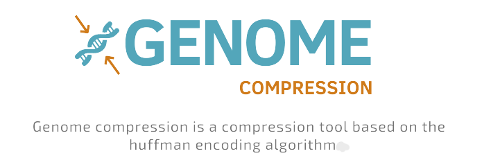
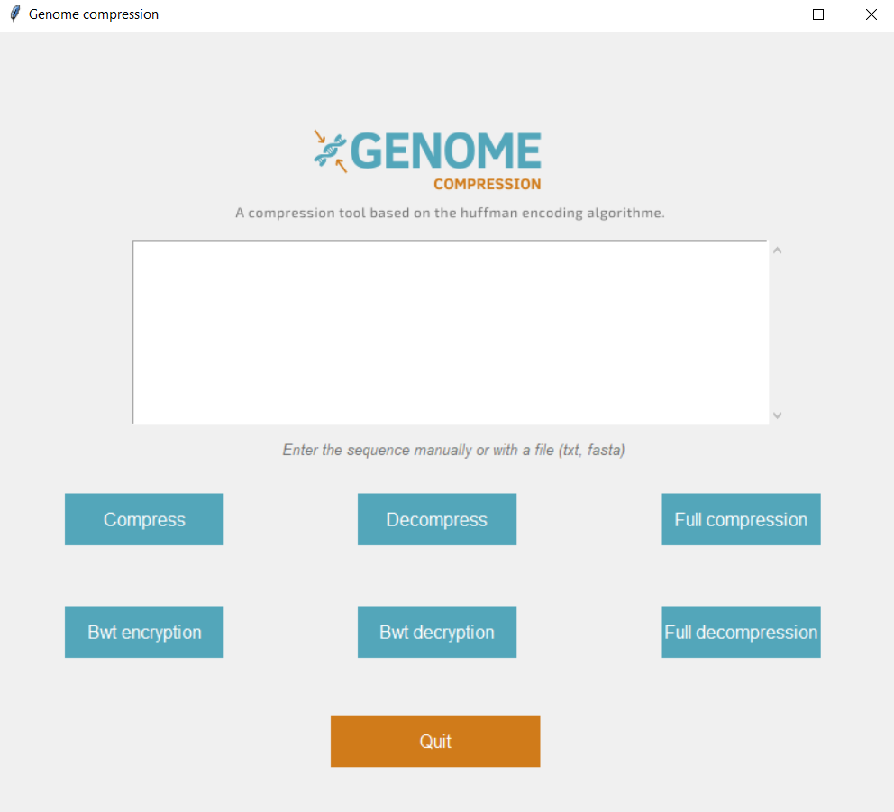
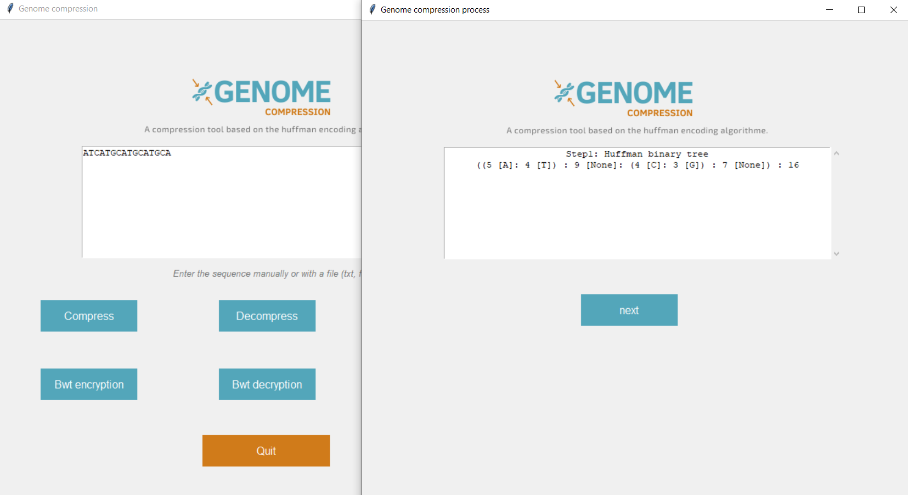

# Genome compression using the Burrows Wheeler Transform and the Huffman coding
<!--
*** Thanks for checking out the Best-README-Template. If you have a suggestion
*** that would make this better, please fork the repo and create a pull request
*** or simply open an issue with the tag "enhancement".
*** Thanks again! Now go create something AMAZING! :D
-->
![Python][python-shield]
![tkinter][tkinter-shield]


<!-- PROJECT SHIELDS -->
<!--
*** I'm using markdown "reference style" links for readability.
*** Reference links are enclosed in brackets [ ] instead of parentheses ( ).
*** See the bottom of this document for the declaration of the reference variables
*** for contributors-url, forks-url, etc. This is an optional, concise syntax you may use.
*** https://www.markdownguide.org/basic-syntax/#reference-style-links
-->

[![MIT License][license-shield]][license-url]
[![LinkedIn][linkedin-shield]][linkedin-url]


<!-- PROJECT LOGO -->
<br />
<p align="center">
  <a href="https://github.com/othneildrew/Best-README-Template">
    
  </a>

  <h3 align="center" style="font-weight:bold">Burrows Wheeler Transform and Huffman coding</h3>

  <p align="center">
    <span style="font-weight:bold; font-style:italic">with Python</span> 
    <br /><br>
    <a href="https://en.wikipedia.org/wiki/Burrows%E2%80%93Wheeler_transform"><strong>Explore the BWT »</strong></a><br>
    <a href="https://en.wikipedia.org/wiki/Huffman_coding"><strong>Explore the Huffman coding »</strong></a>
    <br />
    <br />

  </p>
</p>


<!-- TABLE OF CONTENTS -->
<details open="open">
  <summary>Table of Contents</summary>
  <ol>
    <li>
      <a href="#about-the-project">About The Project</a>
      <ul>
        <li><a href="#built-with">Built With</a></li>
      </ul>
    </li>
    <li>
      <a href="#getting-started">Getting Started</a>
      <ul>
        <li><a href="#prerequisites">Prerequisites</a></li>
        <li><a href="#installation">Installation</a></li>
      </ul>
    </li>
    <li><a href="#usage">Usage</a></li>
    <li><a href="#roadmap">Roadmap</a></li>
    <li><a href="#contributing">Contributing</a></li>
    <li><a href="#license">License</a></li>
    <li><a href="#contact">Contact</a></li>
    <li><a href="#acknowledgements">Acknowledgements</a></li>
  </ol>
</details>


<!-- ABOUT THE PROJECT -->
## About The Project

<br>


This project implements the Burrows Wheeler Transform and the Huffman coding algorithm using Python in order to compress genome sequences.

We can use this application:
* To compress genome files (*fasta*, *txt*).
* To decompress files to get genomic sequence.
* To implement *step by step* the Burrows Wheeler Transform of a given sequecne.
* To decrypt a Burrows Wheeler Sequence.
* To visualize the full compression and decompression process of a genome.

Of course, we can enter genomic sequence manually or with a file (*fasta*, *txt*)

### Built With

* [Python](https://www.python.org/)
* [Tkinter](https://docs.python.org/3/library/tkinter.html)


<!-- GETTING STARTED -->
## Getting Started

To get a local copy up and running follow these simple steps

### 1. Clone the repo  
* Clone the repository locally

  ```sh
  git clone https://github.com/LouaiKB/-BWT-Huffman-coding
  
  cd -BWT-Huffman-coding/
  ```

### 2.Installation

* Install all the dependencies from the *requirements.txt*
   ```sh
   pip install -r rquirements.txt
   ```
* If problems occur with the dependecies installation try:
   ```sh
    pip install -r requirements.txt --no-index --find-links file:///tmp/packages
   ```
### 3. Start the app
   ```sh
   cd scripts/
   
   # run main.py
   python main.py
   ```


<!-- USAGE EXAMPLES -->
## Usage

### 1. Compression process

* If you want to proceed the compression of a file you can enter the sequence manually in the text box then press the compression button. Or if you have a genome file **Note:Enter only fasta or txt files** you can press button directly to proceed the compression step by step.
* Once you click the button a toplevel window appears **ET VOILA!**
<br><br>

<br><br>

* Next button to complete the process

<br>

<br><br>

<br><br>

<br><br>

<br><br>

**NOTICE: The compression process will save two files the compressed file + json associated file which will be used for the decompression process**

## 2. Decompression process
* For the decompression **WE CAN'T ENTER THE SEQUENCE MANUALLY** because we need the json associated file.
* Press decompress and choose the compressed sequence file and the json associated to this file. **NOTICE: The compressed file and the json file have the same name**


<!-- ROADMAP -->
## Roadmap

See the [open issues](https://github.com/othneildrew/Best-README-Template/issues) for a list of proposed features (and known issues).


<!-- CONTRIBUTING -->
## Contributing

Contributions are what make the open source community such an amazing place to be learn, inspire, and create. Any contributions you make are **greatly appreciated**.

1. Fork the Project
2. Create your Feature Branch (`git checkout -b feature/AmazingFeature`)
3. Commit your Changes (`git commit -m 'Add some AmazingFeature'`)
4. Push to the Branch (`git push origin feature/AmazingFeature`)
5. Open a Pull Request


<!-- LICENSE -->
## License

Distributed under the MIT License. See `LICENSE` for more information.


<!-- CONTACT -->
## Contact

Your Name - [@your_twitter](https://twitter.com/your_username) - email@example.com

Project Link: [https://github.com/your_username/repo_name](https://github.com/your_username/repo_name)


<!-- ACKNOWLEDGEMENTS -->
## Acknowledgements
* [GitHub Emoji Cheat Sheet](https://www.webpagefx.com/tools/emoji-cheat-sheet)
* [Img Shields](https://shields.io)
* [Choose an Open Source License](https://choosealicense.com)
* [GitHub Pages](https://pages.github.com)
* [Animate.css](https://daneden.github.io/animate.css)
* [Loaders.css](https://connoratherton.com/loaders)
* [Slick Carousel](https://kenwheeler.github.io/slick)
* [Smooth Scroll](https://github.com/cferdinandi/smooth-scroll)
* [Sticky Kit](http://leafo.net/sticky-kit)
* [JVectorMap](http://jvectormap.com)
* [Font Awesome](https://fontawesome.com)


<!-- MARKDOWN LINKS & IMAGES -->
<!-- https://www.markdownguide.org/basic-syntax/#reference-style-links -->
[tkinter-shield]:https://img.shields.io/badge/tkinter-8.6-blue?style=for-the-badge&logo=python
[python-shield]:https://img.shields.io/badge/Python-3.8-blue?style=for-the-badge&logo=python
[license-shield]: https://img.shields.io/badge/License-MIT-blue?style=for-the-badge
[license-url]: https://github.com/othneildrew/Best-README-Template/blob/master/LICENSE.txt
[linkedin-shield]: https://img.shields.io/badge/-LinkedIn-black.svg?style=for-the-badge&logo=linkedin&colorB=555
[linkedin-url]: https://www.linkedin.com/in/louai-kassa-baghdouche-b23408170/
[product-screenshot]: images/screenshot.png
